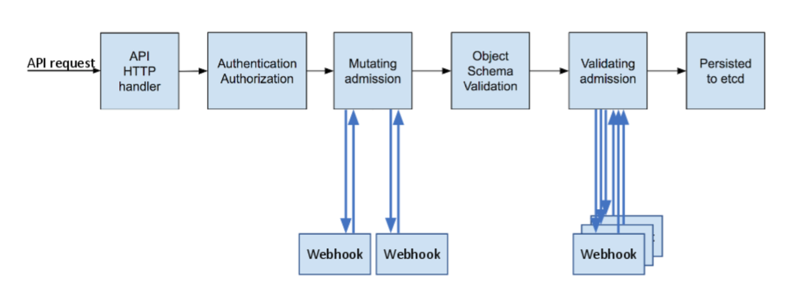

= Kyverno - Eine Übersicht
:toc:

== Vorwort

Kyverno ist ein Admission Controller, welcher sehr viele Möglichkeiten gibt, um über Policies Vorgaben auf einem OpenShift-Cluster umzusetzen. Dabei ist Kyverno "Kubernetes-native" und verwendet als Sprache für die Polices YAML, was es für viele einfacher macht, als Polices in Rego zu schreiben.

Alle Dateien, die wir hier nutzen, sind auch im Ordner "kyverno-showcase-policies" verfügbar. Wenn in einem Abschnitt eine Datei genutzt wird, steht im Abschnitt ein entsprechender Hinweis.

== Admission Controller

Zunächst kurz ein paar Sätze dazu, was überhaupt "Admission Controller" sind. Immer, wenn ein Objekt in OpenShift angelegt, verändert oder gelöscht wird, läuft diese Anforderung über die API von OpenShift. Und das unabhängig davon, ob man den OC-Client oder die Weboberfläche verwendet.

Und während das Opject durch die API läuft, gibt einem OpenShift die Möglichkeit, bei beliebigen Objekten einzugreifen. Die Objekte können verändert und überprüft werden.

https://cloud.redhat.com/blog/dynamic-admission-control

Wie man sieht, gibt es eine "Mutating admission" und eine "Validating admission", über die man durch den Webhook eingreifen kann. Und genau diesen Mechanismus nutzen Admission Controller.

Auf einem OpenShift Cluster gibt es unterschiedliche Admission Controller. Ein Beispiel ist der Red Hat Service Mesh. Die Control Plane des Service Meshs prüft beispielsweise über einen eigenen Admission Controller, ob eine bestimmte Annotation in einem Deployment vorhanden ist und fügt dann allen Pods einen Envoy-Proxy als zusätzlichen Container hinzu. Dabei wird die "Mutating admission" verwendet.

Ein Beispiel für die "Validating admission" sind RASP-Tools wie "Red Hat Advanced Cluster Security", "Aquasec" oder "Neuvector". Diese RASP-Tools wollen Objekte nicht verändern, aber überprüfen, ob diese vorgegebenen Anforderungen entsprechen, um die Sicherheit zu gewährleisten.

Kyverno kann beide ansprechen, sowohl "Mutating admission" als auch "Validating admission" und ist damit extrem flexibel einsetzbar.

== Die Kyverno Dokumentation

Die, sehr umfangreiche, Dokumentation zu Kyverno findet man unter https://kyverno.io/docs/

An dieser Stelle kann nur ein erster Überblick bzw. Einstieg gegeben werden. Kyverno ist viel zu umfangreich, um alles hier darzustellen.

== Die Installation von Kyverno

https://kyverno.io/docs/installation/methods/

Kyverno wird normalerweise über Helm installiert. Dies kann man direkt machen, so wie es unter obigem Link beschrieben ist. Bei Bedarf kann man sich den aktuellen Chart lokal herunterladen und verwenden. Dieses Beispiel lädt den Chart in das aktuelle Verzeichnis herunter:

[source]
----
helm pull kyverno/kyverno --untar=true --untardir=.
----

== Die wichtigsten CRDs von Kyverno

Kyverno bringt einige CRDs mit sich. Die wichtigsten sind:

[cols="1,1"]
|===
|Policy
|Eine Policy, welche sich nur auf einen angegebenen Namespace bezieht

|ClusterPolicy
|Eine clusterweite Policy

|AdmissionReport
|Eine Auswertung der Policyanwendungen auf Namespaceebene

|ClusterAdmissionReport
|Eine Auswertung der Policyanwendungen auf Clusterebene

|BackgroundScanReport
|Eine Auswertung der BackgroundScans auf Namespaceebene

|ClusterBackgroundScanReport
|Eine Auswertung der BackgroundScans auf Clusterebene
|=== 

Eventuell wird hier erst in einem späteren Abschnitt deutlich, was genau damit gemeint ist.

== Admission ClusterPolicy "Check Namespace"

Fangen wir einfach mit einer ersten Policy einmal an. Wir wollen prüfen, ob ein neu ersteller Namespace ein bestimmtes Label enthält. 

Dateien: 01-validate-clusterpolicy-check-namespace-label.yaml

[source,yaml]
----
apiVersion: kyverno.io/v2beta1
kind: ClusterPolicy
metadata:
  annotations:
    policies.kyverno.io/description: >-
      Checks if all namespaces have set a label "hello" with the value "world"
    policies.kyverno.io/severity: low
    policies.kyverno.io/subject: Namespace
    policies.kyverno.io/title: Test Namespace Annotation
  name: test-namespace-annotation
spec:
  background: false
  rules:
    - exclude:
        any:
          - resources:
              namespaces:
                - openshift*
                - kube*
                - default
      match:
        any:
          - resources:
              kinds:
                - Namespace
      name: test-namespace-label
      validate:
        anyPattern:
          - metadata:
              label:
                hello: world
        message: All new Namespaces must have a label "hello" with the value "world".
  validationFailureAction: audit
----

Die wichtigsten Elemente der Policy kurz erklärt:

Am "kind" sehen wir, dass es sich natürlich um eine ClusterPolicy handelt. Anders würde das Prüfen von Namespaces auch keinen Sinn ergeben.

Im Abschnitt "rules" finden wir die verschiedenen Abschnitte "exclude", "match" und "validate".

Im Abschnitt "exclude" stehen dabei Regeln, auf die diese Policy nicht zutreffen soll. Wir möchten nicht, dass diese Regel auf Namespaces angewendet wird, die mit "openshift" oder "kube" beginnen und sie soll auch nicht für einen Namespace "default" gelten.

Im Abschnitt "match" befindet sich die Regel, worauf die Policy angewendet werden soll. Sie woll für alle Ressoucen vom Typ "Namespace" gelten.

Im Abschnitt "validate" steht, was genau geprüft werden soll. Dass es diesen Abschnitt gibt bedeutet, dass wir hier eine "Validate admission" haben. Geprüft wird, ob das angegebene Label vorhanden ist.

Am Ende steht noch "validationFailureAction: audit". Wir möchten zunächst nur, dass die Policy im "Audit" Modus läuft. Dann wird sie bereits verwendet, aber sie wird noch nicht erzwungen. Ein Namespace kann daher jetzt auch dann noch angelegt werden, wenn das Label nicht vorhanden ist. Die Alternative wäre "validationFailureAction: enforce".

Wenn diese Policy nun aktiv ist, erstellen wir einmal zwei Namespaces:

Datei: 01-namespace-a.yaml

[source,yaml]
----
kind: Namespace
apiVersion: v1
metadata:
  name: a-test
  labels:
    hello: world
----

Datei: 01-namespace-b.yaml

[source,yaml]
----
kind: Namespace
apiVersion: v1
metadata:
  name: b-test
----

Wenn man die Namespaces anlegt, dann passiert zunächst nichts Besonderes. Dadurch, dass wir eine ClusterPolicy haben, erstellt Kyverno nun aber automatisch einen ClusterAdmissionReport:

[source]
----
oc get clusteradmissionreport -A
NAME                                   AGE   PASS   FAIL   WARN   ERROR   SKIP
55a254a2-eee1-4d29-a6b7-5b1ba890b3be   7s    1      0      0      0       0
839c2835-c9bd-4f41-a7d3-87cd4d8466c1   5s    0      1      0      0       0
----

Und hier sehen wir, dass ein Namespace der Regel entsprach ("PASS") und einer nicht ("FAIL").

Wenn wir in einen Report schauen, sehen wir in der YAML, worauf sich der Report bezieht, also in unserem Fall einen bestimmten Namespace und entweder "result: fail" oder "result: pass".

An dieser Stelle ändern wir nun die Policy. Wir löschen nun einmal die beiden Namespaces und die Policy und verwenden diese neue Policy, die genau das gleiche macht, nun aber als Action nicht mehr "audit", sondern "enforce" hat:

Datei: 02-validate-clusterpolicy-check-namespace-label.yaml

[source,yaml]
----
apiVersion: kyverno.io/v2beta1
kind: ClusterPolicy
metadata:
  annotations:
    policies.kyverno.io/description: >-
      Checks if all namespaces have set a label "hello" with the value "world"
    policies.kyverno.io/severity: low
    policies.kyverno.io/subject: Namespace
    policies.kyverno.io/title: Enforce Namespace Annotation
  name: enforce-namespace-annotation
spec:
  background: false
  rules:
    - exclude:
        any:
          - resources:
              namespaces:
                - openshift*
                - kube*
                - default
      match:
        any:
          - resources:
              kinds:
                - Namespace
      name: test-namespace-label
      validate:
        anyPattern:
          - metadata:
              label:
                hello: world
        message: All new Namespaces must have a label "hello" with the value "world".
  validationFailureAction: enforce
----

Wenn wir jetzt die obigen Namespaces erneut anlegen, sehen wir durchaus sofort die Auswirkung. Der erste Namespace lässt sich problemlos anlegen. Aber beim zweiten Namespace erhalten wir eine Fehlermeldung, welche auch die "message" unserer Policy enthält:

[source]
----
Error from server: error when creating ".\\01-namespace-b.yaml": admission webhook "validate.kyverno.svc-fail" denied the request:

resource Namespace//b-test was blocked due to the following policies

enforce-namespace-annotation:
  test-namespace-label: 'validation error: All new Namespaces must have a label "hello"
    with the value "world". rule test-namespace-label[0] failed at path /metadata/labels/hello/'
----

Und wenn wir uns dann die ClusterAdmissionReports ansehen, stellen wir fest, dass wir nur einen erhalten, nicht zwei:

[source]
----
oc get clusteradmissionreport -A
NAME                                   AGE   PASS   FAIL   WARN   ERROR   SKIP
4af50de4-22bd-48e8-97a9-c805559462ce   77s   1      0      0      0       0
----

Der Grund ist, dass im "Enforce" Modus keine Reports für abgelehnte Ressourcen erstellt werden können, da die dazugehörige Ressource gar nicht existiert. Sie wurde ja geblockt.

== Ein Background Check

Nun löschen wir wieder unsere Policy und legen dann auch den zweiten Namespace einmal an, so dass wir beide Namespaces haben.

Dann nutzen wir nun die folgende Policy:

Datei: 03-validate-clusterpolicy-check-namespace-label.yaml

[source,yaml]
----
apiVersion: kyverno.io/v2beta1
kind: ClusterPolicy
metadata:
  annotations:
    policies.kyverno.io/description: >-
      Checks if all namespaces have set a label "hello" with the value "world"
    policies.kyverno.io/severity: low
    policies.kyverno.io/subject: Namespace
    policies.kyverno.io/title: Background Test Namespace Label
  name: background-test-namespace-label
spec:
  background: true
  rules:
    - exclude:
        any:
          - resources:
              namespaces:
                - openshift*
                - kube*
                - default
      match:
        any:
          - resources:
              kinds:
                - Namespace
      name: test-namespace-label
      validate:
        anyPattern:
          - metadata:
              labels:
                hello: world
        message: All new Namespaces must have a label "hello" with the value "world".
  validationFailureAction: audit
----

Wir haben nun "background: true" konfiguriert. Nun schaut Kyverno nicht nur beim Erstellen eines Objekts nach, sondern prüft einmal alle Objekte auf dem Cluster, die zu der Policy passen. Also werden nun alle Namespaces auf das Label geprüft, außer die Namespaces "openshift*", "kube*" und "default".

Wir erhalten dann folgendes Ergebnis:

[source]
----
oc get clusterbackgroundscanreport -A
NAME                                   PASS   FAIL   WARN   ERROR   SKIP   AGE
064b357b-3fdd-48a5-9cbc-c5633781f94d   0      1      0      0       0      104s
4af50de4-22bd-48e8-97a9-c805559462ce   1      0      0      0       0      104s
88c10d5b-75cf-49b8-b2d6-3a1f51f910a3   0      1      0      0       0      104s
adc0ab33-37f2-4bb1-86f1-952c2103cf54   0      1      0      0       0      104s
----

Zur Auswertung müssen wir in die einzelnen Reports schauen. Wir sehen, dass wir einen Namespace haben, der das Label besitzt, unseren Namespace "a-test".

Dann sehen wir, dass es drei Namespaces gibt, welche das Label nicht haben. Hier waren dies: b-test, hostpath-provisioner und kyverno.

Man sieht schon daran, dass man bei Policies, welche "validationFailureAction: enforce" verwenden, wirklich aufpassen muss, damit man nicht die Erstellung von Ressourcen verhindert, welche angelegt werden sollen oder gar müssen.

Den Namespace "kyverno" kann man übrigens durch entsprechende Konfiguration der "values.yaml" für Kyverno direkt von allen Policies ausnehmen.

Daher ist es eine gute Idee, wenn möglich, zunächst einen BackgroundScan zu aktivieren.

Backgroundscans arbeiten immer im Modus "Audit", auch wenn "Enforce" in der Policy konfiguriert ist. Es gibt aber einen Unterschied bei den Reports: https://main.kyverno.io/docs/policy-reports/background/

== Einschränkung der BackgroundScans

Die backgroundScans haben eine wichtige Einschränkung, die unten auf der Seite beschrieben ist: https://main.kyverno.io/docs/policy-reports/background/

Sie funktionieren nur bei Objekten aus den Bereichen "request.object" und "request.namespace". Daher funktionieren sie nicht bei z.B. Rollen.

Was aber hat es mit dem Bereich "request.object" überhaupt auf sich? Denn in einer Ressource wie "Namespace" finden wir den Bereich nicht. Das liegt daran, dass am Admission Controller nicht das Objekt "Namespace" ankommt, sondern ein "AdmissionReview" für ein Namespace-Objekt.

Informationen dazu findet man unter https://kyverno.io/docs/writing-policies/variables/

== Der AdmissionReview

Kyverno kann, im Gegensatz zu vielen anderen Tools, den AdmissionReview sichtbar machen. Diesen kann man nämlich nicht direkt über "oc" auslesen, es ist auch ein flüchtiges Objekt, welches nur kurzfristig existiert.

Das dafür notwendige Setting findet man auf der Seite https://kyverno.io/docs/troubleshooting/#policy-definition-not-working

Man sollte das nur kurzfristig machen und keinesfalls dauerhaft aktiv lassen, da es mehr Last erzeugt.

Wenn wir in die YAML des Deployments für den "kyverno-admission-Controller" schauen, findet man dort bereits die Einstellung "--dumpPayload=false". Diesen setzen wir nun einmal auf "true", woraufhin OpenShift die Pod neu startet.

Wenn wir nun einen neuen Namespace anlegen und dann die Logs für die Pod des "kyverno-admission-controllers" betrachten, sehen wir dort den AdmissionReview, der natürlich noch formatiert werden muss.

Und darin finden wir dann die entsprechenden Abschnitt des Requests wie "object" oder "namespace". Aber auch die, welche wir eben nicht mit einem BackgroundScan anfragen können wie "userInfo".

[source,json]
----
{
    "uid": "e467ec26-f070-4d3f-89ca-70cc143cacca",
    "kind": {
        "group": "",
        "version": "v1",
        "kind": "Namespace"
    },
    "resource": {
        "group": "",
        "version": "v1",
        "resource": "namespaces"
    },
    "requestKind": {
        "group": "",
        "version": "v1",
        "kind": "Namespace"
    },
    "requestResource": {
        "group": "",
        "version": "v1",
        "resource": "namespaces"
    },
    "name": "c-test",
    "namespace": "c-test",
    "operation": "CREATE",
    "userInfo": {
        "username": "kubeadmin",
        "uid": "935f70c6-fa2a-4864-aff6-db3120b71059",
        "groups": [
            "system:authenticated:oauth",
            "system:authenticated"
        ],
        "extra": {
            "scopes.authorization.openshift.io": [
                "user:full"
            ]
        }
    },
    "roles": [
        "kube-system:extension-apiserver-authentication-reader",
        "openshift-config-managed:console-public",
        "openshift-config-managed:openshift-network-public-role",
        "openshift-config-managed:system:openshift:oauth-servercert-trust",
        "openshift-console-user-settings:user-settings-935f70c6-fa2a-4864-aff6-db3120b71059-role",
        "openshift:copied-csv-viewer",
        "openshift:shared-resource-viewer"
    ],
    "clusterRoles": [
        "basic-user",
        "cluster-admin",
        "cluster-status",
        "console-extensions-reader",
        "helm-chartrepos-viewer",
        "self-access-reviewer",
        "self-provisioner",
        "system:basic-user",
        "system:build-strategy-docker",
        "system:build-strategy-jenkinspipeline",
        "system:build-strategy-source",
        "system:discovery",
        "system:oauth-token-deleter",
        "system:openshift:discovery",
        "system:openshift:public-info-viewer",
        "system:openshift:scc:restricted-v2",
        "system:openshift:useroauthaccesstoken-manager",
        "system:public-info-viewer",
        "system:scope-impersonation",
        "system:webhook"
    ],
    "object": {
        "apiVersion": "v1",
        "kind": "Namespace",
        "metadata": {
            "creationTimestamp": "2023-06-18T15:04:30Z",
            "labels": {
                "kubernetes.io/metadata.name": "c-test"
            },
            "managedFields": [
                {
                    "apiVersion": "v1",
                    "fieldsType": "FieldsV1",
                    "fieldsV1": {
                        "f:metadata": {
                            "f:labels": {
                                ".": {},
                                "f:kubernetes.io/metadata.name": {}
                            }
                        }
                    },
                    "manager": "Mozilla",
                    "operation": "Update",
                    "time": "2023-06-18T15:04:30Z"
                }
            ],
            "name": "c-test",
            "uid": "8f537c89-e6b9-455b-b649-283cc91cc945"
        },
        "spec": {
            "finalizers": [
                "kubernetes"
            ]
        },
        "status": {
            "phase": "Active"
        }
    },
    "oldObject": null,
    "dryRun": false,
    "options": {
        "apiVersion": "meta.k8s.io/v1",
        "kind": "CreateOptions"
    }
}
----

== Mutation ClusterPolicy "Add Resources to BuildConfig"

Dateien:

04-mutate-clusterpolicy-add-resources-to-buildconfig.yaml
04-buildconfig.yaml

Wie schon erwähnt, kann Kyverno nicht nur Admission Policies nutzen, sondern auch Mutating Policies.

Dazu nehmen wir uns folgendes Szenario: Ein Cluster hat gesetzte Limitranges und dort Werte für Requets und Limits. Diese gelten, wenn nichts anderes vom Entwickler konfiguriert wird, für alle Pods, welche auf dem Cluster erstellt werden. Oft benötigen Pods gar nicht so viele Ressourcen, so dass der Wert in den Limitranges entsprechend gewählt ist. Daraus resultiert jedoch, dass Builds, wenn in den BuildConfigs nicht höhere Ressourcenwerte angegeben sind, recht langsam laufen. Wir wollen also erreichen, dass eine BuildConfig immer Ressourcenwerte für Limits besitzt. Entweder, weil der Entwickler welche angegeben hat oder durch unsere Policy.

Eine solche Policy kann wie folgt aussehen:

[source,yaml]
----
apiVersion : kyverno.io/v1
kind: ClusterPolicy
metadata:
  name: add-resources-to-buildconfig
  annotations:
    policies.kyverno.io/title: Add Resources to BuildConfig
    policies.kyverno.io/category: Other
    policies.kyverno.io/severity: medium
    policies.kyverno.io/subject: BuildConfig
    policies.kyverno.io/description: >-
      If a BuildConfig does not specify at least resource limits it can happen
      that the build will be slow because the default-values of the limitranges settings
      will be applied.
      This policy checks if settings for memory and cpu limits are available and if not
      applies the settings below.
      This policy will exclude all namespaces that start with "openshift" or "kube".
      IMPORTANT: The setting "schemaValidation: false" is because of a bug in the actual
      kyverno version and can be deleted in 1.9+.
      IMPORTANT: If there is no nodeselector or the nodeselector is set to "null", than
      this version of kyverno shows in the annotation of the buildconfig "removed /spec/nodeSelector".
      This seems to be a bug in this version. The nodeselector will not be touched, only the resources.
spec:
  background: false
  schemaValidation: false
  rules:
  - name: add-resources-to-buildconfig
    match:
      any:
      - resources:
          kinds:
          - BuildConfig
    exclude:
      any:
      - resources:
          namespaces:
          - openshift*
          - kube*
    preconditions:
      any:
      - key: "{{request.operation || 'BACKGROUND'}}"
        operator: AnyIn
        value:
        - CREATE
        - UPDATE
    mutate:
      patchStrategicMerge:
        spec:
          resources:
            limits:
              +(memory): "2Gi"
              +(cpu): "1"
----

Die Policy schaut auf alle neu erstellten Ressourcen vom Typ "BuildConfig", wenn es sich um eine Neuerstellung oder ein Update der Ressource handelt. Sie ignoriert die Namespaces "openshift*" und "kube*".

Im Gegensatz zu einer Validation Policy hat diese Policy einen Anschnitt "mutate". Dort steht 

[source,yaml]
----
resources:
  limits:
    +(memory): "2Gi"
    +(cpu): "1"
----

Das "+" mit der Klammer bedeutet, dass diese Werte dann hinzugefügt werden, wenn diese noch nicht existieren. So kann der Entwickler trotzdem eigene Werte angeben. Kyverno kennt verschiedene solcher Methoden:

https://kyverno.io/docs/writing-policies/mutate/#conditional-logic-using-anchors
https://kyverno.io/docs/writing-policies/validate/#anchors

Nun erstellen wir eine Buildconfig. Dazu einen Imagestream, da sonst kein Tag auf diesen Imagestream gesetzt werden kann:

[source,yaml]
----
kind: ImageStream
apiVersion: image.openshift.io/v1
metadata:
  name: mywebsite
  namespace: a-test
spec:
  lookupPolicy:
    local: false
----

[source,yaml]
----
apiVersion: build.openshift.io/v1
kind: BuildConfig
metadata:
  name: mywebsite
  labels:
    app: mywebsite
spec:
  source:
    type: Git
    git:
      uri: https://github.com/monodot/container-up
    contextDir: httpd-hello-world
  strategy:
    type: Docker                      
    dockerStrategy:
      dockerfilePath: Dockerfile    # Look for Dockerfile in: gitUri/contextDir/dockerfilePath
  output:
    to:
      kind: ImageStreamTag
      name: mywebsite:latest
----

Und wir sehen, dass die BuildConfig unsere Ressourcen erhalten hat. Wenn wir nun einen Build starten, hat dieser ebenso die Ressourcen, wie auch die daraus resultierenden Pods.

== Generate Clusterpolicy "Add CM to Namespace"

Kyverno kann nicht nur Ressourcen verändern, sondern, basierend auf Ressourcen, auch neue Ressourcen erstellen.

Anbei ein Beispiel:

[source,yaml]
----
apiVersion: kyverno.io/v1
kind: ClusterPolicy
metadata:
  name: add-cm-to-namespace
spec:
  rules:
  - name: add-cm-to-namespace
    match:
      any:
      - resources:
          kinds:
          - Namespace
    exclude:
      any:
      - resources:
          namespaces:
          - kube*
          - default
          - openshift*
          - kyverno
    generate:
      synchronize: true
      apiVersion: v1
      kind: ConfigMap
      name: my-configmap
      # generate the resource in the new namespace
      namespace: "{{request.object.metadata.name}}"
      data:
        kind: ConfigMap
        metadata:
          labels:
            somekey: somevalue
        data:
          INFO: "May the force be with you."
----

Diese Ressource schaut, ob ein Namespace angelegt wird. Wenn dies der Fall ist, wird zusätzlich eine ConfigMap in dem Namespace angelegt und dieser ConfigMap erhält sowohl ein Label als auch ein Key-Value-Paar als Inhalte.

Die Option "synchronize: true" bedeutet, dass Kyverno die Objekte weiterhin im Auge behält. Würde die Regel beispielsweise nur für Namespaces mit einem bestimmten Label gelten und wir würden dieses Label später entfernen, dann würde Kyverno auch die ConfigMap wieder entfernen, da die Policy nun nicht mehr zutrifft.

== Cleanup Policies

Dieses Festure von Kyverno befindet sich aktuell noch im Alpha-Status und unterliegt eventuell einigen Änderungen. Daher wird es hier nicht ausführlich erwähnt.

Cleanup Policies sorgen dafür, dass Ressourcen, basierend auf der Policykonfiguration, automatisch entfernt werden.

== Kyverno CLI

Kyverno besitzt auch ein Kommandozeilentool: Kyverno CLI: https://kyverno.io/docs/kyverno-cli/

Das jeweils aktuelle Release finden wir unter https://github.com/kyverno/kyverno/releases

Man muss unbedingt darauf achten, dass die CLI Version zur eingesetzten Kyverno Version passt. Bei der 3.0.9 von Kyverno ergaben sich da einige wesentliche Änderungen. Zur 3.0.0 passt die CLI Version 1.10.0:

[source]
----
DESKTOP-6ELUJDD:~$ kyverno version

Version: 1.10.0
Time: 2023-05-30T10:01:31Z
Git commit ID: da6f5c18132f773af15d0e09cbf2e16a36725232
----

